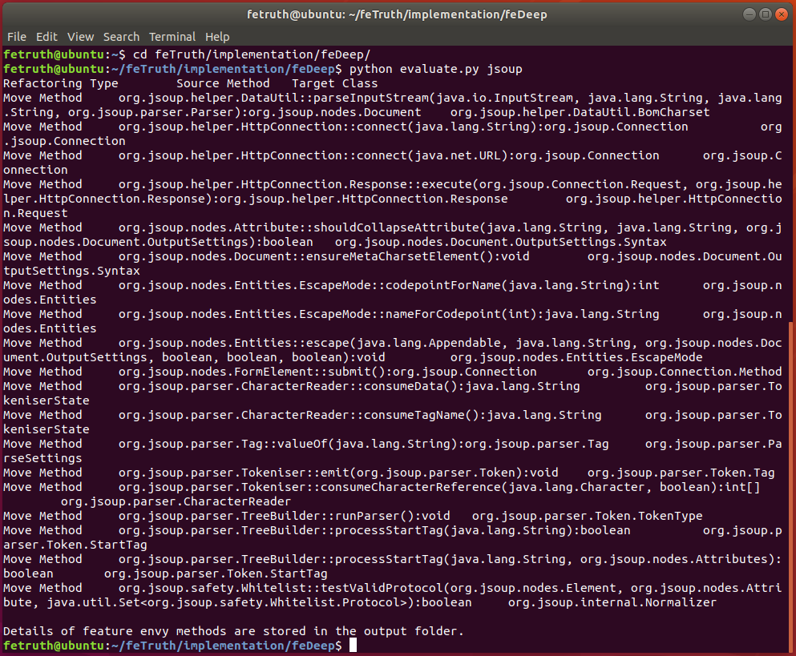
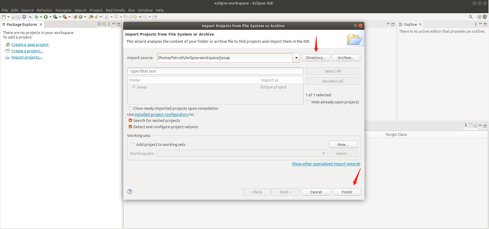
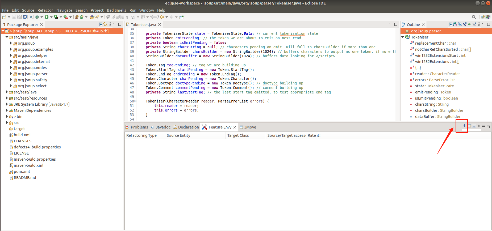
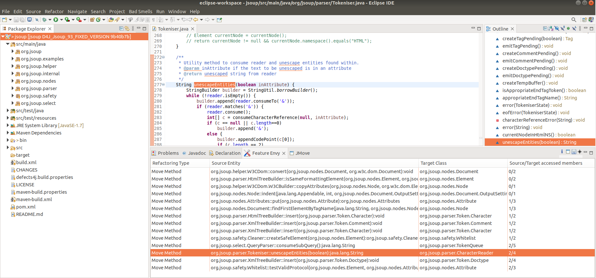
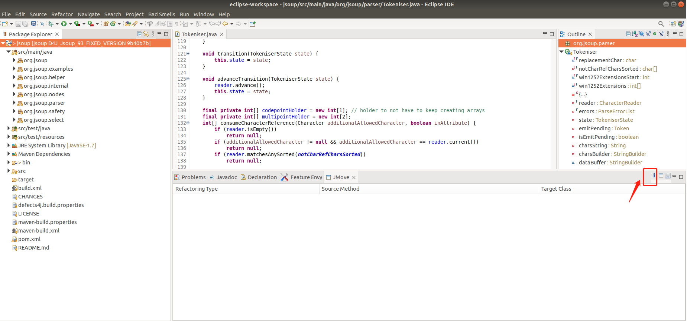
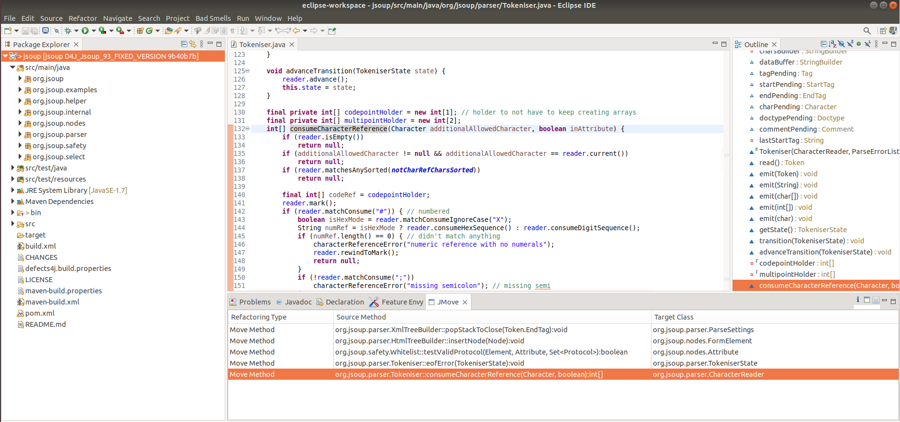

# Table of Contents

- [General Introduction](#general-introduction)
- [Contents of the Replication Package](#contents-of-the-replication-package)
- [Requirements](#requirements)
- [How to Replicate the Evaluation?](#how-to-replicate-the-evaluation)

# General Introduction

This is the replication package for FSE2023 submission, containing both tools and data that are requested by the
replication. It also provides detailed instructions to replicate the evaluation.

# Contents of the Replication Package

/data: Data involved in the evaluation.

/experiment: The evaluation of the proposed approach and the selected baselines.

/implementation: The implementation of the evaluated approaches (including the proposed approach and baseline approach).

/library: Third-party libraries requested by the evaluation.

/word2vec: Pre-trained word2vec model requested by the evaluation.

# Requirements

- Python == 3.6
- Tensorflow == 2.4.0
- Keras == 2.4.3
- Numpy == 1.19.5
- Gensim == 3.8.0
- Scikit-learn == 0.24.2

You may setup the requirements via any of the following commands:

1. requirements.txt

   `pip install -r requiremetns.txt`

2. setup.py

   `python setup.py` or `./setup.py`

3. conda environment

   `conda env create -f fetruth.yaml`

# How to Replicate the Evaluation?

1. Clone replicate package to your local file system:

   `git clone https://github.com/lyoubo/feTruth.git`

   Now, the resulting repository in your local system should look as follows:

   

2. Install dependencies:

   `cd feTruth/library`

   `pip install -r requirements.txt`

3. Download the third-party pre-trained word2vec
   model [`new_model.bin.trainables.syn1neg.npy`](https://doi.org/10.5281/zenodo.5749111)
   and [`new_model.bin.wv.vectors.npy`](https://doi.org/10.5281/zenodo.5749111) from Zenodo and put them into
   folder `word2vec`. And now, the folder `word2vec` should contain 3 files (including one copy automatically from this
   repository):

   

4. Evaluate  **feTruth**:

   `cd feTruth/implementation/feTruth/`

   `python evaluate.py [project_name]`

   Evaluation results are presented as follows:

   

   The reported feature envy methods are available at `feature_envy_methods.txt` in folder `output`:

5. Evaluate **feDeep**:

   `cd feTruth/implementation/feDeep/`

   `python evaluate.py [project_name]`

   Evaluation results are presented as follows:

   

   The reported feature envy methods are available at `feature_envy_methods.txt` in folder `output`:

6. Evaluate **JDeodorant**:

   6.1 Import Testing Project:

   

   6.2 Identify Bad Smell:

   

   6.3 Identification results are presented as follows:

   

7. Evaluate **JMove**:

   7.1  Import Testing Project:

   

   7.2 Identify Move Methods Opportunities:

   

   7.3 Identification results are presented as follows:

   
